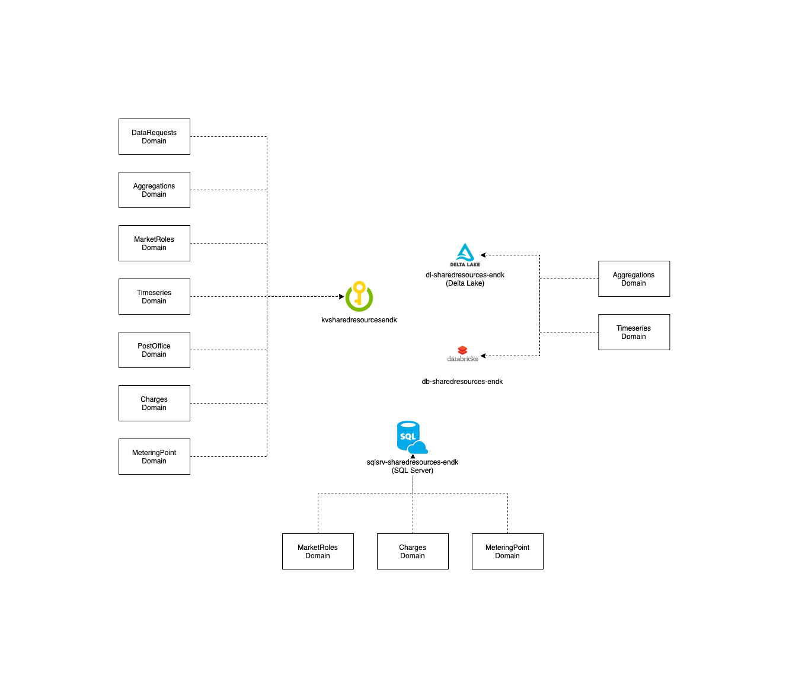

# Shared Resources

- [Intro](#intro)
- [Architecture](#architecture)
- [Domain Roadmap](#domain-roadmap)
- [Getting Started](#getting-started)
    - [Setting up the domain](#setting-up-the-domain)
- [Using the shared resources](#using-the-shared-resources)
    - [Shared SQL Server](#shared-sql-server)
    - [Shared SQL Server User](#shared-sql-server-user)
    - Shared Service Bus
        - [Creating resources under the domain relay Service Bus Namespace](#creating-resources-under-the-integration-events-service-bus-namespace)
        - [Connecting to the domain relay Service Bus Namespace](#connecting-to-the-integration-events-service-bus-namespace)
- [Where can I get more help](#where-can-i-get-more-help)

## Intro

This domain will contain shared components of infrastructure, as well as code which we want to "centralize".
Initially we will work towards translating incoming ebiX messages in xml to an internal CIM format .

## Architecture



## Domain Roadmap

In this program increment we are working towards:

- Shared infrastructure will be identified and established.
- Publishing a NuGet package capable of converting Danish ebiX RSM-001, RSM-004 and RSM-033 documents to CIM compliant documents.
- Creation of best practices for working and interacting with domains.

## Setting up the domain

[Read here how to get started](https://github.com/Energinet-DataHub/green-energy-hub/blob/main/docs/getting-started.md).

## Using the shared resources

You will from each domain be able to use resources inside the shared resources domain.
The shared resources is created, to prevent other domains from being to hard coupled, but integrating into each other.

If you need to share secrets between domains, you can use the shared Key Vault as a mediator for these.

If you need to publish domain relay, you can use the domain relay Service Bus Namespace.

Below is a guide on how to use the different resources.

### Shared SQL Server

The shared SQL Server is an empty server that other domains can add databases into.

Before you start using the shared SQL Server, you will need to expose the following variables to your IaC.

- A variable containing the name of the shared resource group. In the example below this is referred to as `sharedresources_resource_group_name`.
- A variable containing the name of the SQL Server. In the example below this is referred to as `sharedresources_sql_server_name`.

These should be added to the environment as secrets, and parsed down through the pipeline, to ensure the flexibility of changing these in the future.

Once these is added, you can start using the snippets below.

1 - Create a reference to the shared resource group.

```ruby
data "azurerm_resource_group" "shared_resources" {
  name = var.sharedresources_resource_group_name
}
```

2 - Create a reference to the shared SQL server.

```ruby
data "azurerm_sql_server" "sqlsrv" {
  name                = var.sharedresources_sql_server_name
  resource_group_name = data.azurerm_resource_group.shared_resources.name
}
```

3 - You can now use these references in the local resources you want to create.

```ruby
module "sqldb_example" {
  source              = "git::https://github.com/Energinet-DataHub/geh-terraform-modules.git//sql-database?ref=REPLACE_WITH_CURRENT_VERSION"
  name                = "sqldb-${var.project}-${var.organisation}"
  resource_group_name = data.azurerm_resource_group.shared_resources.name
  location            = data.azurerm_resource_group.shared_resources.location
  tags                = data.azurerm_resource_group.shared_resources.tags
  server_name         = data.azurerm_sql_server.sqlsrv.name
}
```

<!-- ### Shared SQL Server User

To use the shared admin user for the server, you can refer to the keyvault secrets, using the Terraform Data Resource.
This will eventually be replaced by Azure AD Authentication.

```ruby
data "azurerm_key_vault_secret" "SHARED_RESOURCES_DB_ADMIN_NAME" {
  name         = "SHARED-RESOURCES-DB-ADMIN-NAME"
  key_vault_id = data.azurerm_key_vault.kv_shared.id
}

data "azurerm_key_vault_secret" "SHARED_RESOURCES_DB_ADMIN_PASSWORD" {
  name         = "SHARED-RESOURCES-DB-ADMIN-PASSWORD"
  key_vault_id = data.azurerm_key_vault.kv_shared.id
}
``` -->

### Creating resources under the domain relay Service Bus Namespace

The domain relay Service Bus Namespace is an empty namespace that other domains can add queues and topics into.

Before you start using the service bus namespace, you will need to expose the following variables to your IaC.

- A variable containing the name of the shared resource group. In the example below this is referred to as `sharedresources_resource_group_name`.
- A variable containing the id of the service bus namespace. In the example below this is referred to as `sharedresources_domainrelay_service_bus_namespace_id`.

These should be added to the environment as secrets, and parsed down through the pipeline, to ensure the flexibility of changing these in the future.

Once these is added, you can start using the snippets below.

1 - Create a reference to the shared resource group.

```ruby
data "azurerm_resource_group" "shared_resources" {
  name = var.sharedresources_resource_group_name
}
```

2 - Create a reference to the Service Bus Namespace.

```ruby
data "azurerm_servicebus_namespace" "domainrelay" {
  id                  = var.sharedresources_domainrelay_service_bus_namespace_id
}
```

3 - You can now refer to the namespace from your local resources.

```ruby
module "sb_example" {
  source              = "git::https://github.com/Energinet-DataHub/geh-terraform-modules.git//azure/service-bus-queue?ref=REPLACE_WITH_CURRENT_VERSION"
  name                = "sb-example"
  namespace_id        = data.azurerm_servicebus_namespace.domainrelay.id
}
```

### Connecting to the domain relay Service Bus Namespace

The domain relay Service Bus Namespace comes with 2 connection strings, one for publishing messages into the service bus, and one for listening for messages.

Before you start using the service bus namespace connection strings, you will need to expose the following variables to your IaC.

- A variable containing the name of the shared resource group. In the example below this is referred to as `sharedresources_resource_group_name`.
- A variable containing the name of the shared key vault. In the example below this is referred to as `sharedresources_keyvault_name`.

These should be added to the environment as secrets, and parsed down through the pipeline, to ensure the flexibility of changing these in the future.

Once these is added, you can start using the snippets below.

1 - Create a reference to the shared key vault.

```ruby
data "azurerm_key_vault" "kv_shared" {
  name                = var.sharedresources_keyvault_name
  resource_group_name = var.sharedresources_resource_group_name
}
```

2.a - To send messages use the snippet below.

```ruby
data "azurerm_key_vault_secret" "kvs_sb_domain_relay_send_connection_string" {
  name         = "sb-domain-relay-send-connection-string"
  key_vault_id = data.azurerm_key_vault.kv_shared.id
}
```

2.b - To listen for new messages, use the snippet below.

```ruby
data "azurerm_key_vault_secret" "kvs_sb_domain_relay_listen_connection_string" {
  name         = "sb-domain-relay-listen-connection-string"
  key_vault_id = data.azurerm_key_vault.kv_shared.id
}
```

3 - You can now refer to this value from the needed resources by using the following variables

Reading
`data.azurerm_key_vault_secret.kvs_sb_domain_relay_listen_connection_string.value`

Writing
`data.azurerm_key_vault_secret.kvs_sb_domain_relay_send_connection_string.value`

## Where can I get more help?

Please see the [community documentation](https://github.com/Energinet-DataHub/green-energy-hub/blob/main/COMMUNITY.md)
